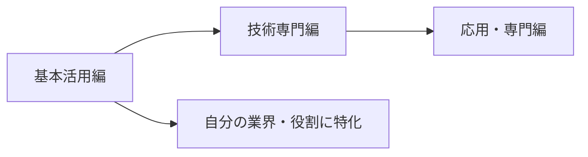

# 📚 Markdown AI Collaborator 活用Tips集

## 🎯 この Tips 集について

このディレクトリには、Markdown AI Collaboratorを様々なシーンで効果的に活用するための実践的なTipsが含まれています。各ファイルは特定の用途や業界に特化した活用方法を詳しく解説しています。

## 📖 Tips ファイル一覧

### 基本活用編

| ファイル名 | 概要 | 対象者 |
|-----------|------|--------|
| [01_効果的な質問テクニック.md](./01_効果的な質問テクニック.md) | AI とのやりとりを最大限活用する質問の仕方 | 全ユーザー |
| [02_GitHub統合活用術.md](./02_GitHub統合活用術.md) | GitHubとの連携による知識管理とチーム協働 | 開発者・チーム |
| [03_プロジェクト管理での活用法.md](./03_プロジェクト管理での活用法.md) | プロジェクト立ち上げから運用まで | PM・リーダー |
| [04_学習・教育での活用例.md](./04_学習・教育での活用例.md) | 個人学習からチーム教育まで | 学習者・教育者 |

### 技術専門編

| ファイル名 | 概要 | 対象者 |
|-----------|------|--------|
| [05_APIドキュメント分析術.md](./05_APIドキュメント分析術.md) | API仕様書の体系的理解と実装準備 | 開発者・アーキテクト |
| [06_コードレビュー効率化.md](./06_コードレビュー効率化.md) | レビューの質と効率を両立する手法 | 開発者・レビュアー |
| [07_技術文書作成支援.md](./07_技術文書作成支援.md) | 読みやすく実用的な技術文書の作成 | テクニカルライター・開発者 |
| [08_アーキテクチャ設計支援.md](./08_アーキテクチャ設計支援.md) | システム設計の意思決定支援 | アーキテクト・設計者 |

### 応用・専門編

| ファイル名 | 概要 | 対象者 |
|-----------|------|--------|
| [09_業界特化活用法.md](./09_業界特化活用法.md) | 金融、医療、製造業等の業界特有の活用 | 業界専門家 |
| [10_トラブルシューティング手法.md](./10_トラブルシューティング手法.md) | 体系的な問題解決アプローチ | エンジニア・運用担当 |

## 🚀 効果的な活用方法

### 1. 段階的な学習

### 2. シーン別の使い分け

**日常業務での活用**:
- 01_効果的な質問テクニック → 基本的なやりとりスキル向上
- 02_GitHub統合活用術 → チームでの継続的な知識蓄積

**プロジェクトでの活用**:
- 03_プロジェクト管理での活用法 → 企画・設計・開発・運用の各フェーズ
- 08_アーキテクチャ設計支援 → システム設計時の意思決定支援

**技術スキル向上**:
- 04_学習・教育での活用例 → 新技術の学習・チーム教育
- 05_APIドキュメント分析術 → 外部サービス連携時

**品質向上**:
- 06_コードレビュー効率化 → 開発プロセスの改善
- 07_技術文書作成支援 → ドキュメント品質向上

**問題解決**:
- 10_トラブルシューティング手法 → 障害対応・問題解決

### 3. カスタマイズのすすめ

各Tipsは基本的な枠組みを提供しています。実際の利用時は：

- **自社・チームの状況に合わせて調整**
- **業界固有の要件を追加**
- **使用頻度の高い質問パターンをテンプレート化**
- **継続的な改善と更新**

## 💡 活用のベストプラクティス

### ✅ 効果的な使い方

- **複数のTipsを組み合わせて使用**
- **実際のドキュメントで練習**
- **チーム内での知見共有**
- **定期的な振り返りと改善**

### ❌ 避けるべき使い方

- **Tips を読むだけで実践しない**
- **画一的な適用（状況を考慮しない）**
- **一人だけで使用（チーム展開しない）**
- **古い情報のまま更新しない**

## 🔧 トラブルシューティング

### よくある質問

**Q: どのTipsから始めればよいですか？**
A: まず「01_効果的な質問テクニック」で基本を身につけ、その後自分の役割に近いTipsを選択してください。

**Q: 複数のTipsを同時に使えますか？**
A: はい。例えば「05_APIドキュメント分析術」で分析した内容を「07_技術文書作成支援」で文書化するなど、組み合わせて使用することを推奨します。

**Q: チーム導入のコツは？**
A: 「02_GitHub統合活用術」を参考に、小さな成功事例から始めて段階的に拡大することをお勧めします。

### サポートとフィードバック

- **改善提案**: GitHub Issues で受け付けています
- **使用事例の共有**: 成功事例の共有歓迎
- **新しいTipsの提案**: コミュニティからの提案をお待ちしています

## 📊 効果測定

### 定量的指標

- **質問の回答精度向上**
- **ドキュメント作成時間短縮**
- **コードレビュー効率化**
- **障害対応時間短縮**

### 定性的指標

- **チーム内知識共有の活性化**
- **技術的な意思決定の質向上**
- **学習効率の改善**
- **業務満足度の向上**

---

💡 **継続的改善のために**

このTips集は生きた文書として、皆さんの実践と改善提案により進化していきます。実際に使用して得られた知見や改善点があれば、ぜひフィードバックをお寄せください。